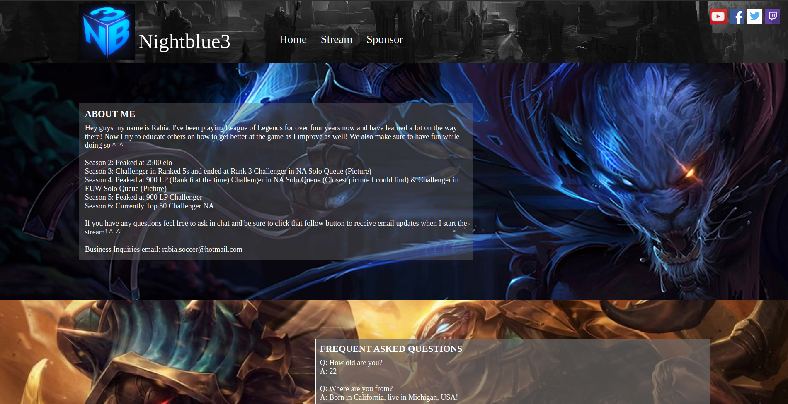

# Nightblue3 (2016)
Highschool project for the supplementary subject of Computer Science.  
It is a static website puerly on html and css. Deployment was done with docker.

## How to run it
1. Run: git clone https://github.com/municola/nightblue3.git
2. Open index.html with your Browser
